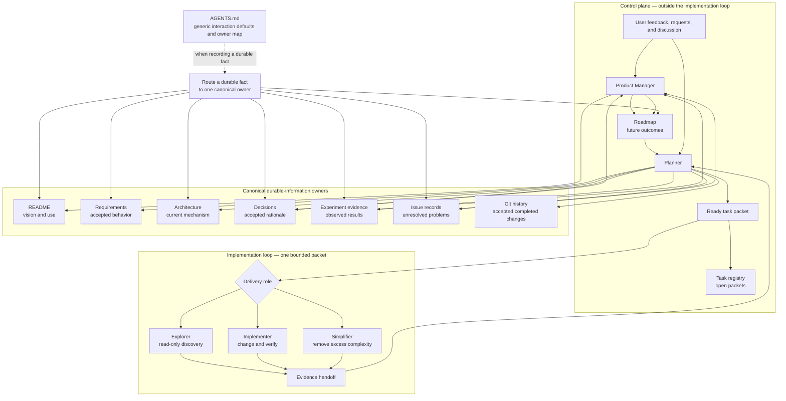

# Information Flow

This document owns the visual map of how durable information moves through the
repository. It is a map, not a procedure: ordinary discussion and read-only
exploration do not enter the implementation loop. For task lifecycle and
delegation rules, use [agent workflow](agent-workflow.md).

## Reading the map

- The Product Manager and Planner are control-plane actors. They set direction,
  prepare a bounded packet, and accept its result; they are not delivery roles.
- Explorer, Implementer, and Simplifier operate only after a packet enters the
  implementation loop. Each returns evidence to the Planner rather than making
  unaccepted product or authority choices.
- The Planner routes accepted findings to one canonical owner. A finding may
  link to related records, but it is recorded in only one owner.
- `AGENTS.md` applies the owner rule only when a durable fact is recorded. It
  does not require a workflow for ordinary discussion, review, or read-only
  exploration.
